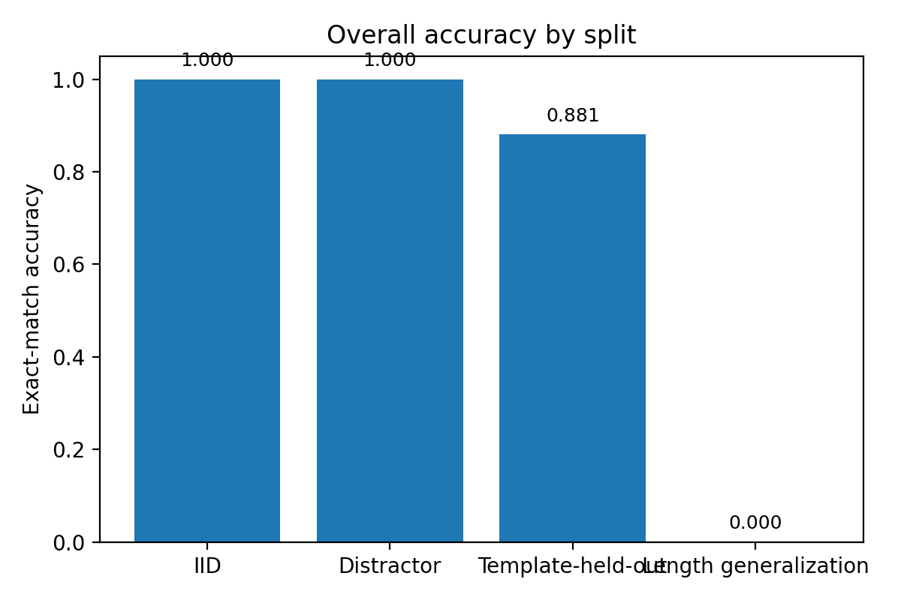
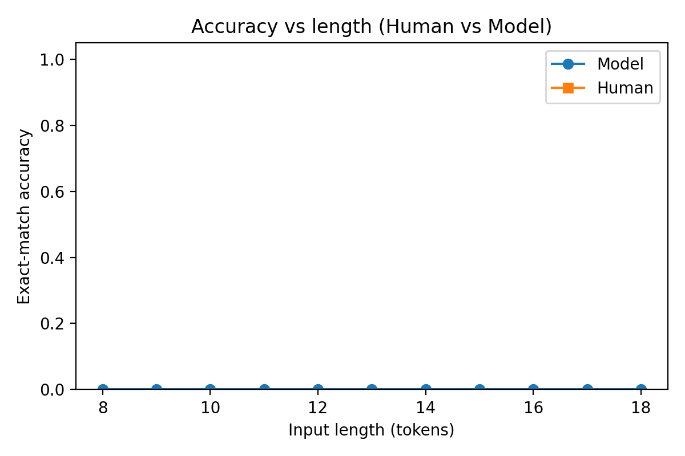
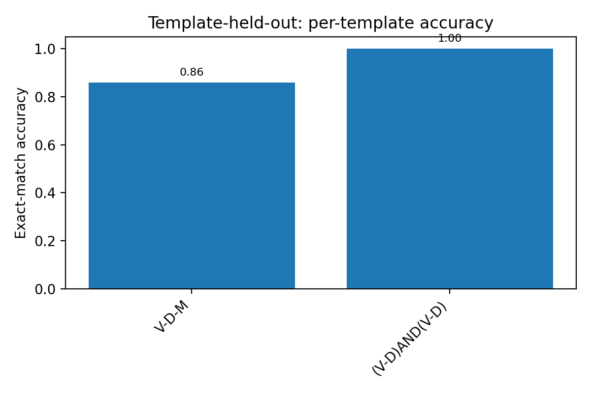

# Where Today’s AI Trips Up (and Humans Don’t)

## What we tested
We trained a small AI model to translate simple text commands (like “walk right and jump left”) into action sequences. It did great on examples that looked like what it saw during training.

**Overall snapshot:**  

## Where it breaks
When we asked the model to handle **longer** or **new combinations** of commands, performance dropped sharply. People, however, still understood and answered correctly.

**Human vs Model — by length:**  

## Why it matters
This shows a key gap: the model often **memorizes** patterns instead of learning rules it can **build on**. Humans naturally recombine pieces to handle longer or novel instructions.

**Harder patterns (examples):**  

## What would help
Add better structure to the model (memory or rule-like components), and train with tasks that **force** real composition (not just repetition). Until then, expect strong scores on familiar data but sudden failures when requests get longer or more novel.
