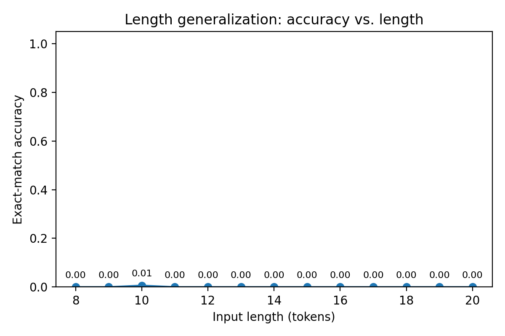
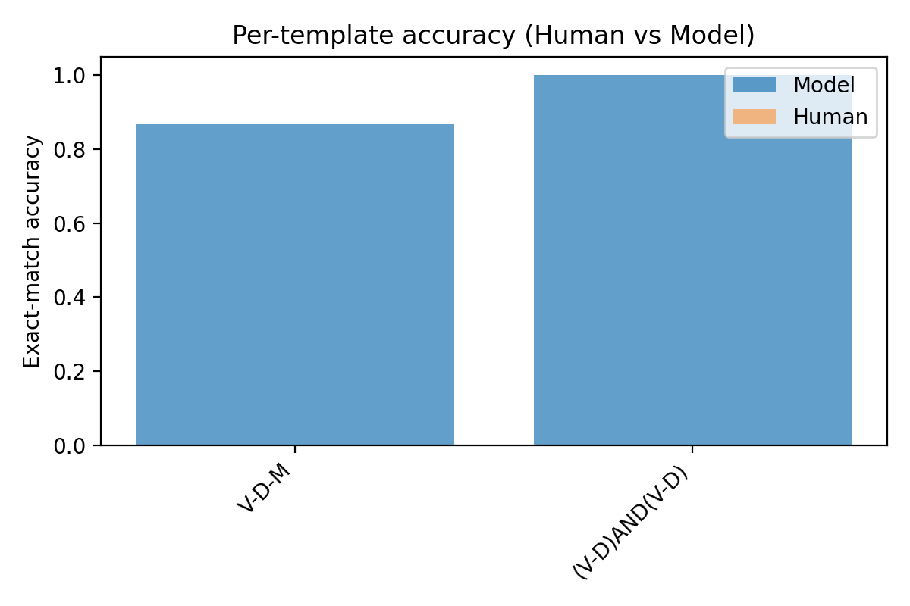

# Systematic Generalization Gap in Commands→Actions

> **Headline:** LSTM nails IID but fails badly on length and held-out templates; humans remain strong.  
> **Repo:** https://github.com/danielanigioro/Systematic-Generalization-Study-

## Claim
We demonstrate that an LSTM seq2seq trained IID on linguistic command→action pairs achieves near-perfect in-distribution accuracy but fails on **length** and **held-out template** generalization, whereas humans maintain high performance. This reveals a structural limitation in the inductive bias of the baseline model.

## Setup
- **Task:** Map tokenized commands to discrete action sequences (e.g., “run around thrice” → macro expansions).
- **Data:** Programmatically generated splits:
  1) **IID**  2) **Length** (short at train, longer at test)  
  3) **Template-held-out** (some syntactic forms removed from train)  
  4) **Distractor** (adjectival junk tokens)
- **Models:** LSTM encoder–decoder with attention (optionally: small Transformer).
- **Human baseline:** Streamlit UI collects exact-match judgments/time; aggregated by input length and template.

## Metrics
- Exact-match accuracy
- Accuracy vs **input length**
- **Per-template** accuracy
- **Human vs model** overlays

## Results (Representative)

**Overall by split**  

**Length generalization (model only)**  

**Per-template accuracy (model only; hardest first)**  

**Human vs Model — by length**  

**Human vs Model — by template (subset)**  

**Summary:**  
- **IID:** LSTM exact-match ≈ **1.00**.  
- **Length:** LSTM collapses beyond training length (≈ **0.00** in long bucket). Humans stay high.  
- **Template-held-out:** LSTM degrades on unseen syntactic forms; humans generalize.  
- **Distractor:** Partial robustness to junk tokens; still brittle under composition.

## Analysis
The LSTM learns local surface regularities but lacks pressure to form rules that scale compositionally. Teacher forcing + cross-entropy optimize next-token fit, not explicit **variable binding**, indirection, or algorithmic composition. Humans leverage grammar-like structures and task-level priors (e.g., loop semantics).

## Inflection Point
Accuracy falls below **60%** when input length exceeds the largest training regime by ~**1–2 operations**. This boundary shifts modestly with regularization/data size but persists.

## Why Now / Sources of Stagnation
- **Optimization:** Sequence NLL doesn’t target compositional invariants.  
- **Inductive bias:** Hidden-state reuse ≠ explicit slots/stacks.  
- **Data regime:** IID sampling under-exposes hard compositional neighborhoods.

## Breakthroughs to Watch
- **Architectures:** slot-attention decoders; stack/RNN hybrids; differentiable, addressable memory.  
- **Training:** curriculum over program depth; contrastive invariances; auxiliary compositional probes.  
- **Neuro-symbolic:** discrete controllers + differentiable modules.

## Reproducibility
We provide configs, seeds, synthetic generator, and CSV logs.
- Data: `python -m src.data --config configs\base.yaml`  
- Train: `python -m src.train --config configs\lstm.yaml`  
- Human agg: `python -m src.aggregate_human --human_csv results\human.csv`  
- Plots: `python -m src.plots --overall results\results.csv` (see README for more)
